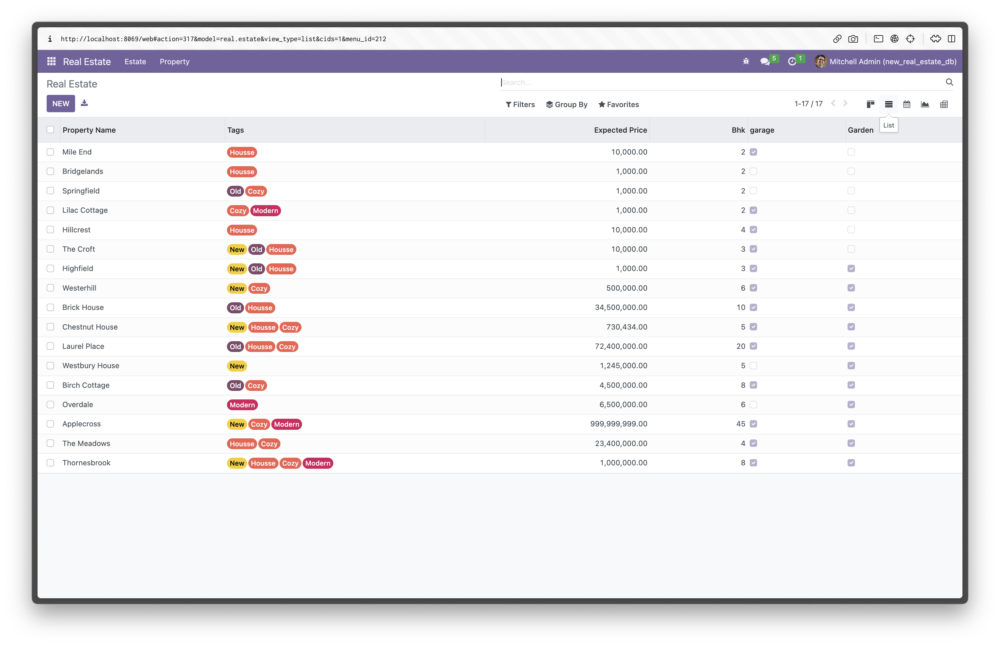
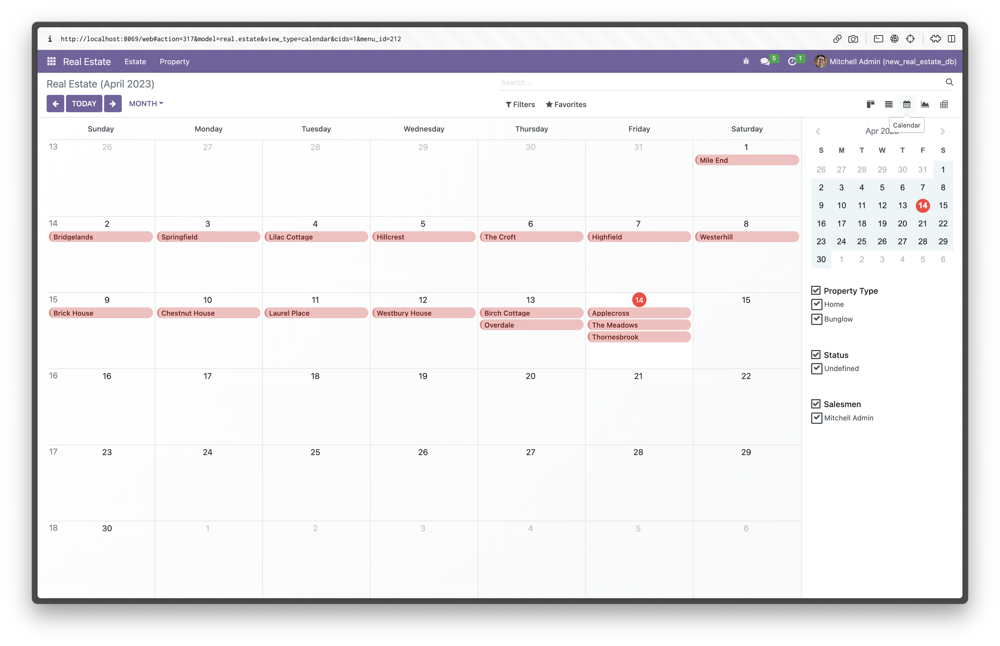
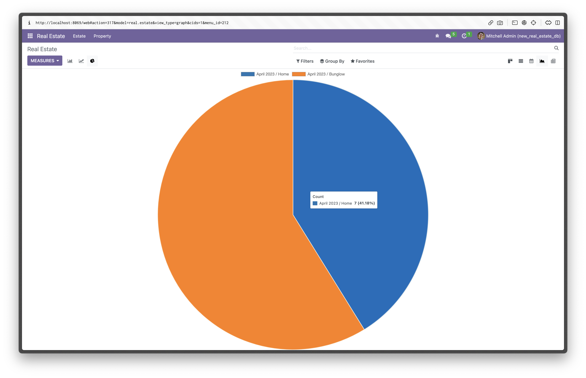
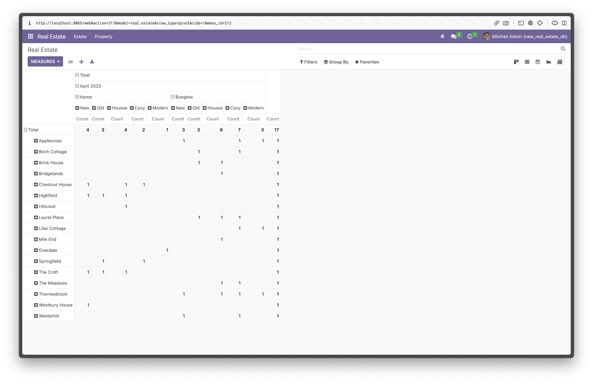
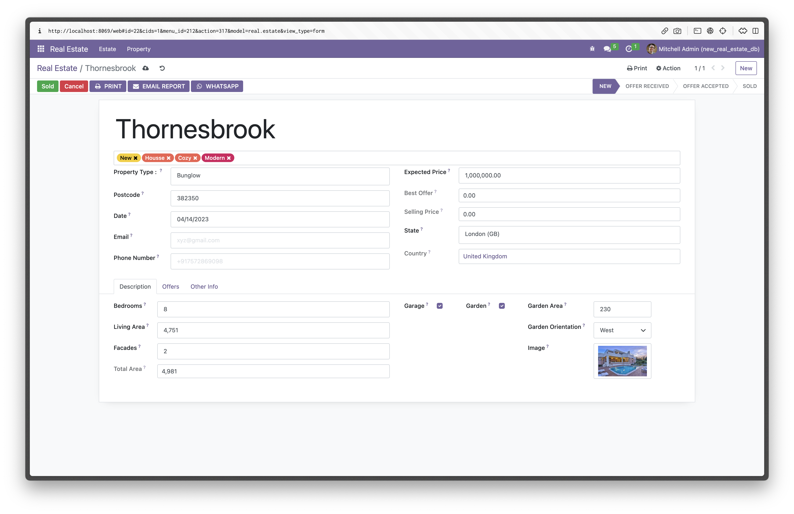

# odoo-Real-Estate

# Maximize your real estate potential with our all-in-one management app

Manage your properties with ease and sell smarter, not harder.

### ABOUT THE APP

Key features of this Real Estate App

------------------------------------------------------------------------

### Property listing

This feature allows users to create and manage property listings for
sale, including descriptions and photos.

------------------------------------------------------------------------

### Offer management

This feature allows users to manage offers received from potential
buyers, including accepting, rejecting, or countering offers. It can
also track the status of offers.

------------------------------------------------------------------------

### Sales management

This feature enables users to manage the sales process, from accepting
an offer to closing the deal. It can include tracking the progress of
the sale.

------------------------------------------------------------------------

### Accounting management

This feature helps users to manage the financial aspects of property
sales, including generating invoices, tracking payments, and managing
commissions.

## **Sale your Properties Here**

##### 

With our app, you can easily list and sell properties, generate offers
reports, and create invoices after sales.

Our app features a Kanban view that displays each property as a card
with relevant details, making it easy to keep track of all your
properties in one place.

Our app is designed to help real estate businesses sell smarter, not
harder, by maximizing their potential and simplifying their property
management tasks.

# Different Views Based on your Choice

## **List Your Property Here**

##### 

With our real estate property management app, adding new properties has
never been easier.

Our intuitive form lets you effortlessly enter all the important details
about your property, from the name and price to available dates and
more.

You can even upload eye-catching images to showcase your properties in
the best light.

Our app makes it easy to stay on top of your listings and provide
potential buyers with all the information they need to make an informed
decision.

With our user-friendly interface and powerful features, managing your
real estate properties has never been more streamlined.

## **Get Offers Right Now**

##### 

Listing your property on our real estate property management app not
only provides exposure to potential buyers but also attracts offers for
your property.

With our app, you can easily track and manage incoming offers for your
property, all in one place. Our algorithm analyzes the incoming offers
and displays the best offer for you, giving you the information you need
to make informed decisions.

With our app, you can rest assured that you are getting the best
possible value for your property.

## **Choose Right Buyer**

##### 

Our real estate property management app takes the hassle out of
selecting the best buyer for your property.

Once you receive offers for your property, our app allows you to easily
compare and review each offer, along with any additional information
provided by the interested parties.

Our streamlined interface makes it easy to select the best buyer for
your property, based on your preferences and criteria. With our app, you
can feel confident that you are making the right choice when it comes to
selling your property.

## **See Other Info**

##### 

Our real estate property management app makes it easy to keep track of
all the important details related to your property sale.

Once you have selected a buyer for your property, our app allows you to
view all the relevant information about the buyer and seller.

With our app, you can stay organized and informed throughout the entire
property selling process, ensuring a smooth and hassle-free experience.

## **Add Tags in ur Property**

##### 

Our real estate property management app allows you to easily categorize
and tag your property, making it more accessible to potential buyers.

You can create tags such as 'new', 'cozy', 'renovated', 'old', or any
other tags that you think are relevant to your property.

By adding these tags, you can ensure that your property appears in the
search results when buyers are looking for properties that match their
preferences.

With our app, you can make it easier for potential buyers to find your
property and increase your chances of a successful sale.

## **What type of ur property?**

##### 

Our real estate property management app allows you to categorize your
property based on its type, making it easier for potential buyers to
find the properties they are looking for.

You can create different types of properties such as 'house',
'apartment', 'bungalow', and more. By adding these property types, you
can ensure that your property appears in the search results when buyers
are looking for a specific type of property.

With our app, you can make it easier for potential buyers to find your
property and increase your chances of a successful sale

## **Property Analytics**

##### 

With our app's powerful reporting feature, you can easily generate
comprehensive PDF reports of all your properties.

These reports can include important details such as property name,
description, image, price, availability, and more. Additionally, each
property can be assigned a unique barcode for easy identification and
tracking.

Our reporting function also allows you to view all the offers received
for a particular property, including the details of the offerer and the
amount offered.

This can help you make informed decisions about which offers to accept
or reject.

By providing all this information in a well-organized and easy-to-read
format, our reporting feature enables you to stay on top of your real
estate management tasks and make data-driven decisions.

## **User Property**

##### 

This picture illustrates how user-created properties in Odoo's real
estate module are visible in the user's tab.

As you can see, the property that was created by the user is displayed
alongside other properties that belong to them.

This feature allows users to easily manage and keep track of the
properties they have created, all within a convenient location.

By providing users with this level of control and visibility over their
properties, Odoo's real estate module empowers them to more effectively
manage their real estate portfolio.

# Different Mails Templates

## **Property Sales Invoice**

##### 

When you sell a property through our app, you can easily generate an
invoice for the transaction.

The invoice will include all the necessary details, such as the buyer's
name and address, the date of the sale, the price of the property, and
any other relevant information.

This feature makes it easy for you to keep track of your sales and
finances in one place, and ensures that all your transactions are
properly documented.

With just a few clicks, you can create a professional-looking invoice
for your property sale.

## Frontend Views

## **All Listed Property**

##### 

real estate website that displays all of the properties that have been
created and listed by users.

This feature provides a centralized location where users can view and
browse all of the available properties on the website.

By aggregating all of the listed properties in one place, users can
easily search and filter through a wide variety of real estate options,
based on their individual preferences and needs.

## **Property Description**

##### 

The page is a dedicated page on a real estate website that provides
users with a comprehensive view of a specific property.

This page is designed to showcase all of the relevant details and
information about the property, giving users a more in-depth
understanding of what it has to offer.

On the page, users can expect to find information such as the property's
location, size, layout, and features.

## **Property offer Page**

##### 

The page is a dedicated page on a real estate website that allows users
to view all of the current offers that have been made on a particular
property.

This page is designed to provide users with transparency around the
offers that have been made on the property, allowing them to make more
informed decisions about their own offer.

In addition to viewing existing offers, users can also submit their own
offer on the property directly from the page.

This feature allows users to easily make an offer without having to
navigate away from the property's listing, streamlining the process and
making it more convenient for users.

## **Property Create page**

##### 

The page is a key feature of any real estate website, as it allows users
to list their own property for sale on the platform.

This page is designed to make it as easy and intuitive as possible for
users to create a listing and provide all of the necessary details about
their property.

On the page, users can expect to see a form or set of fields where they
can enter information about their property, such as its location, size,
features, and any other relevant details.

Users may also be able to upload photos of the property, which can help
to showcase its unique features and appeal to potential buyers.

## **User Property Page**

##### 

The page is a dedicated section of a real estate website where users can
view all of the properties they have listed for sale on the platform.

This page is designed to provide users with an overview of their current
listings and allow them to manage their properties more effectively.

On the page, users can expect to see a list of all of the properties
they have listed for sale, along with basic details such as the property
type, location, and asking price.

Users may also be able to view more detailed information about each
property, such as the number of bedrooms and bathrooms, square footage,
and any special features or amenities.

## **User Property Description Page**

##### 

The page is a dedicated page on a real estate website that provides
users with a comprehensive view of their own listed property.

This page is designed to showcase all of the relevant details and
information about the property, giving users a more in-depth
understanding of what they have listed for sale.

On the page, users can expect to see a wide range of information about
their property, including its location, size, features, and any other
relevant details.

Users may also be able to view photos of the property, which can help to
showcase its unique features and appeal to potential buyers.

## **User Property Edit Page**

##### 

The page is a dedicated page on a real estate website that allows users
to edit and update the details of their own listed property.

This page is designed to make it easy and intuitive for users to make
changes to their listing and ensure that all of the information about
the property is up-to-date.

On the page, users can expect to see a form or set of fields where they
can edit information about their property, such as its location, size,
features, and any other relevant details.

Users may also be able to upload new photos of the property, which can
help to refresh the listing and attract new potential buyers.

### About Us

We are a real estate management company that helps property owners sell
and manage their properties with ease.

#### Social Media

<a href="https://twitter.com/iambhargavs" class="s_social_media_twitter"
target="_blank"><em> Twitter</em></a>
<a href="https://www.linkedin.com/in/bhargav1244/"
class="s_social_media_linkedin" target="_blank"><em>Linkedin</em></a>
<a href="https://www.instagram.com/bhargavs_1244/"
class="s_social_media_instagram" target="_blank"><em>Instagram</em></a>
<a href="https://github.com/BHARGAVPATEL1244"
class="s_social_media_github" target="_blank"><em>Github</em></a>
